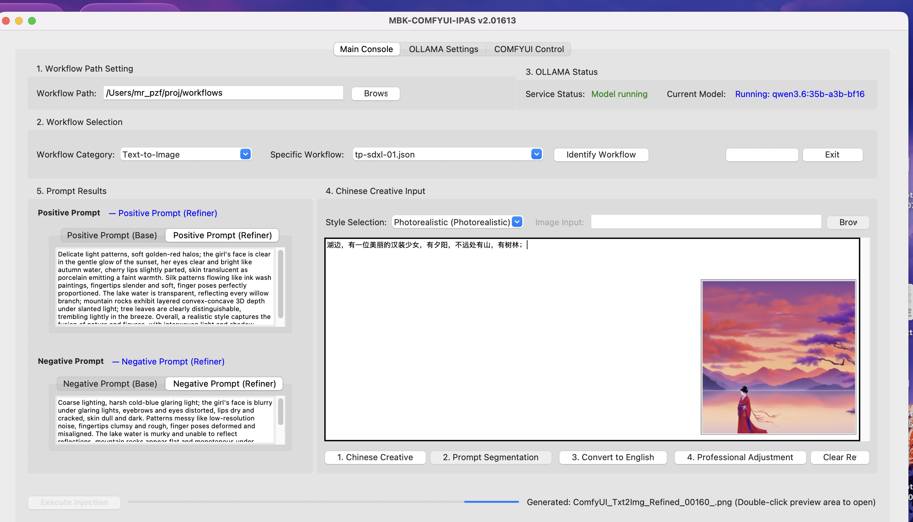

# MBK-IPAS v2.0160 Release Notes

Version `v2.0160` marks a major leap for MBK-IPAS, transforming it from an efficient prompt generation tool into a **full-featured intelligent control and enhancement center for ComfyUI**. Building upon its core strengths, this version introduces an all-new ComfyUI management panel, a native Ollama communication engine, and an expert-level AI + Topology dual-core analysis engine, significantly expanding the application's functional boundaries and professional capabilities.

---

## ✨ Major New Features

### 1. All-New "ComfyUI Control" Tab
A powerful, integrated panel designed for advanced ComfyUI users, providing comprehensive insight and management of the ComfyUI environment from within the tool.
- **Local Plugin Inspection**: Automatically scans and lists all installed packages in the local `custom_nodes` directory.
- **One-Click Missing Node Locator**: Automatically detects custom nodes that are missing from the current workflow and rapidly locates the corresponding plugin package using an integrated **intelligent fuzzy search engine** (fusing data from the official library and GitHub).
- **Node Existence Verification**: Verifies with a single click whether all nodes in the workflow exist locally, highlighting any missing items.
- **Parameter Visualization & Adjustment**: Visually displays key parameters of core nodes in the workflow (e.g., Samplers, Loaders, Resolution Settings) in a flowchart format, with support for future modification capabilities.
- **Environment Helper**: Built-in one-click installation assistants for ComfyUI and Ollama to simplify initial environment setup.

### 2. Full Support for Multimodal Workflows
This version breaks through the "Text-to-Image only" limitation of previous versions, officially reintroducing and enhancing full support for multimodal workflows.
- **Image Input Support**: The "Chinese Creative" module now supports image input. Users can upload an image, and the application will invoke a multimodal large model (e.g., `LLaVA`) to perform a deep analysis and description of the image content, providing a high-quality creative starting point for "Image-to-Image" and "Image-to-Video" workflows.
- **Automatic Workflow Classification**: Enhanced automatic recognition capabilities for "Image-to-Image", "Text-to-Video", and "Image-to-Video" workflow types.

### 3. Expert-Level OLLAMA Management & Communication
- **Native Communication Engine**: The communication layer with Ollama has been rewritten to bypass the OpenAI compatibility mode and interact directly with Ollama's native APIs (`/api/chat`, `/api/generate`). This change **radically solves** compatibility issues and "Unterminated string" errors encountered with newer models like `gemma` and `qwen3`.
- **OLLAMA Settings Enhanced**:
    - **Detailed Model List**: Online model search results are now displayed in a more detailed table view, including model size, available versions, and type.
    - **Model Management**: Added the functionality to delete locally installed models.

### 4. Real-Time Progress Feedback
- **WebSocket Integration**: When executing a ComfyUI workflow, the application now uses a WebSocket connection to listen for real-time execution progress from ComfyUI, dynamically displaying it as a percentage in the UI. This turns long-running generation processes into a transparent experience.

---

## 🚀 Optimizations and Logic Enhancements

### 1. ZenithFlow 4.0 Intelligent Analysis Engine
The new version introduces an "AI + Topology" dual-core analysis engine, dramatically improving the ability to understand and process complex workflows.
- **Topological Traversal**: Utilizes graph algorithms to traverse node connections, accurately determining the positive/negative attributes of prompt nodes and logical segments (e.g., `base`, `refine`). This completely resolves the issue of inaccuracies from the old method, which relied solely on node titles.
- **AI-Powered Deep Positioning**: Added an expert-level feature that abstracts the workflow into a "Structured Semantic Template" (SST) and submits it to a large model for analysis, enabling AI-powered positioning of core logic.
- **Dual-Loop Verification**: Before injecting parameters, a new dual-loop verification step checks for both node existence (physical) and logical consistency, increasing the reliability of the injection process.

### 2. More Robust ComfyUI Integration
- **Precise Format Conversion**: Greatly enhanced the conversion capability from the ComfyUI interface format to the API format. Through `object_info` physical alignment and type recognition, it can now handle various custom nodes and complex situations like `Reroute` nodes with greater precision.
- **Automatic Model Path Correction**: Before submitting a task, the tool now automatically checks and corrects mismatches between model paths in the workflow and local file paths caused by environment differences.

### 3. UI/UX Optimizations
- **Clearer Status Feedback**: The color and text of multiple buttons (e.g., the "Run" button turns green when ready) and status labels have been optimized to give users a more intuitive understanding of the application's state.
- **More Powerful Path Searching**: The algorithm for searching the ComfyUI installation directory has been optimized for more reliable discovery across different file structures.

---

In summary, the core upgrades of `v2.0160` are centered on **"Intelligence"** and **"Professionalism"**. The release is dedicated to automating tedious manual configuration and verification processes, allowing users to focus more on creativity itself.

# MBK-IPAS v2.0160 版本升级说明

`v2.0160` 版本标志着 MBK-IPAS 从一个高效的提示词生成工具，向一个**全功能的 ComfyUI 智能控制与增强中心**的重大跨越。此版本在保留原有核心优势的基础上，引入了全新的 ComfyUI 管理面板、原生Ollama通讯引擎、以及专家级的AI+拓扑双核分析引擎，极大地扩展了应用的功能边界和专业性。

---

## ✨ 主要新增功能

### 1. 全新 “COMFYUI控制” 标签页
一个专为 ComfyUI 深度用户打造的强大集成面板，实现了在工具内对 ComfyUI 环境的全面洞察与管理。
- **本地插件透视**：自动扫描并列出本地 `custom_nodes` 目录下的所有插件包。
- **缺失节点一键定位**：自动检测当前工作流缺失的自定义节点，并通过集成的**智能模糊搜索引擎**（融合官方库与GitHub数据源）快速定位对应的插件包。
- **节点存续验证**：一键验证工作流中的所有节点是否在本地真实存在，高亮显示缺失项。
- **参数可视化调节**：以流程图的模式，可视化展示工作流中核心节点（如采样器、加载器、分辨率设置）的关键参数，并支持未来扩展修改功能。
- **环境助手**：内置 ComfyUI 和 Ollama 一键安装助手，简化初始环境配置。

### 2. 全面支持多模态工作流
突破了旧版仅限“文生图”的局限，正式回归并增强了对多模态工作流的全面支持。
- **支持图片输入**：“中文创意”模块现已支持图片输入。用户可上传图片，程序将调用多模态大模型（如 `LLaVA`）对图片内容进行深度分析和描述，为“图生图”和“图生视频”提供高质量的创意起点。
- **工作流自动分类**：增强了对 "图生图"、"文生视频"、"图生视频" 等工作流类型的自动识别能力。

### 3. 专家级 OLLAMA 管理与通讯
- **原生通讯引擎**：重写了与 Ollama 的通讯层，绕过 OpenAI 兼容模式，直接与 Ollama 的原生 API (`/api/chat`, `/api/generate`) 对话。此举**从根本上解决了** `gemma`, `qwen3` 等新模型下的兼容性问题和 “Unterminated string” 错误。
- **OLLAMA 设置增强**：
    - **模型详情列表**：在线模型搜索结果现以更详细的表格视图展示，包含模型大小、可用版本和类型。
    - **模型管理**：新增了在本地删除已安装模型的功能。

### 4. 实时进度反馈
- **WebSocket 集成**：在执行 ComfyUI 工作流时，程序现在会通过 WebSocket 连接实时监听 ComfyUI 的执行进度，并在界面上以百分比形式动态展示，让长时间的生图过程不再是“盲盒”。

---

## 🚀 功能优化与逻辑改进

### 1. ZenithFlow 4.0 智能分析引擎
新版引入了“AI+拓扑”双核分析引擎，大幅提升了对复杂工作流的理解和处理能力。
- **拓扑图遍历**：通过图算法遍历节点连接关系，精准判断提示词节点的正/负面属性及逻辑分段（如 `base`, `refine`），彻底解决了旧版仅靠节点标题判断容易出错的问题。
- **AI 深度定位**：新增了将工作流抽象为“结构化语义模板”（SST）并提交给大模型进行分析的专家级功能，实现了对工作流核心逻辑的AI定位。
- **双重闭环验证**：在注入参数前，新增了对节点存续性和逻辑一致性的双重校验，提高了注入的可靠性。

### 2. 更健壮的 ComfyUI 对接
- **精准格式转换**：极大地增强了从 ComfyUI 界面格式到 API 格式的转换能力，通过 `object_info` 物理对齐和类型识别，能更精准地处理各种自定义节点和 `Reroute` 等复杂情况。
- **模型路径自动纠正**：在提交任务前，会自动检查并修正因环境差异导致的工作流内模型路径与本地文件不匹配的问题。

### 3. UI/UX 优化
- **状态反馈更清晰**：对多个按钮（如“运行”按钮就绪时变绿）和状态标签的颜色、文本进行了优化，使用户能更直观地了解程序状态。
- **路径搜索更强大**：优化了对 ComfyUI 安装目录的搜索算法，能更可靠地在不同文件结构中定位到目标。

---

总而言之，`v2.0160` 版本的核心升级在于**“智能化”**和**“专业化”**，致力于将繁琐的手动配置和检查流程自动化，让用户能更专注于创意本身。

## Screenshot

